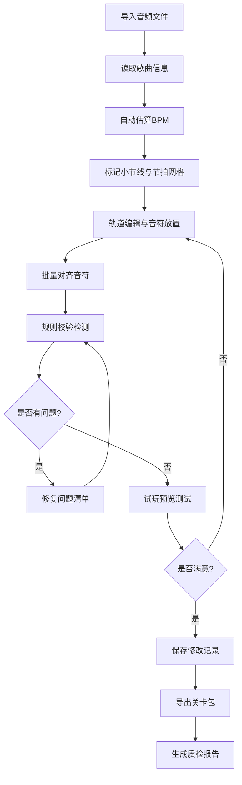
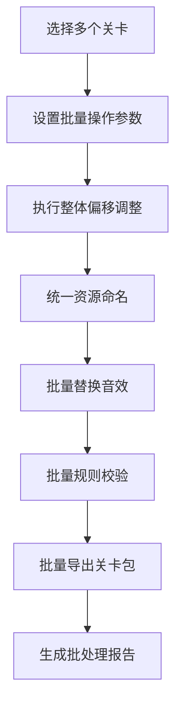

## 1. 产品概述

音乐节奏游戏谱面自动化工具，面向谱师提供一站式谱面制作、质检、批处理解决方案，大幅提升谱面制作效率与质量。

- 目标用户：音乐节奏游戏谱师、游戏开发者、音乐内容创作者
- 核心价值：自动化完成BPM估算、音符对齐、规则校验等重复性工作，内置7大功能模块覆盖谱面制作全流程

---

## 2. 核心功能

### 2.1 用户角色
| 角色 | 注册方式 | 核心权限 |
|------|----------|----------|
| 谱师 | 本地直接使用 | 全部功能，可批量处理谱面文件 |
| 审核员 | 本地直接使用 | 规则校验、版本对比、报告生成 |

### 2.2 功能模块
1. **音频导入**：支持多格式音频导入、读取歌曲元数据、批量导入歌曲库
2. **节拍分析**：自动估算BPM、标记小节线、生成节拍网格、节奏热区分析
3. **轨道编辑**：多轨道可视化编辑、音符拖拽对齐、批量选择调整、判定窗口预览
4. **规则校验**：重叠音符检测、过密段落发现、难度估算、问题清单生成
5. **试玩预览**：实时谱面播放、判定线模拟、音效预览、节奏同步测试
6. **批处理**：整体偏移调整、音效批量替换、资源统一命名、关卡包批量导出
7. **报告**：问题清单导出、版本对比分析、修改记录保存、质检报告生成

### 2.3 页面详情

| 页面名称 | 模块名称 | 功能描述 |
|----------|----------|----------|
| 工作台主页 | 项目概览 | 最近项目列表、快捷操作入口、统计数据展示 |
| 音频导入页 | 音频管理 | 拖拽上传音频、显示波形图、歌曲信息编辑、批量导入队列 |
| 节拍分析页 | BPM分析 | 自动BPM估算、手动微调、小节线标记、节拍网格生成、热区可视化 |
| 轨道编辑页 | 谱面编辑 | 多轨道时间轴、音符编辑工具、批量选择对齐、判定窗口设置、音效替换 |
| 规则校验页 | 质检中心 | 重叠音符检测、过密段落标记、难度评级、问题分类列表 |
| 试玩预览页 | 模拟播放 | 实时谱面播放、按键模拟、判定反馈、速度调节、音效同步 |
| 批处理页 | 批量操作 | 整体时间偏移、资源重命名、音效批量替换、多关卡同时导出 |
| 报告页 | 数据报告 | 问题清单导出、版本差异对比、修改历史记录、质检报告下载 |

---

## 3. 核心流程

### 3.1 谱面制作主流程

### 3.2 批量处理流程

---

## 4. 用户界面设计

### 4.1 设计风格

**整体风格**：深色赛博朋克风格，强调科技感与专业工具属性

- **主色调**：深紫色 (#0a0a1f) 作为背景，霓虹青 (#00f0ff) 作为主强调色，霓虹粉 (#ff00aa) 作为次强调色
- **辅助色**：荧光绿 (#00ff88) 表示成功/通过，警示黄 (#ffcc00) 表示警告，亮红 (#ff3366) 表示错误
- **按钮风格**：圆角矩形，发光边框，悬停时有脉冲光效
- **字体**：展示字体使用 Orbitron（未来科技感），正文字体使用 JetBrains Mono（等宽清晰）
- **布局风格**：模块化卡片布局，支持拖拽面板，多窗口分屏显示
- **图标风格**：线性霓虹图标，带发光效果

### 4.2 页面设计概述

| 页面名称 | 模块名称 | UI元素 |
|----------|----------|--------|
| 工作台主页 | 项目概览 | 渐变英雄区、动态项目卡片网格、实时统计仪表盘、快捷操作悬浮按钮 |
| 音频导入页 | 音频管理 | 拖拽上传区域、波形可视化、频谱分析图、文件队列进度条 |
| 节拍分析页 | BPM分析 | BPM数值显示、节拍波形图、小节线时间轴、热区热力图 |
| 轨道编辑页 | 谱面编辑 | 多轨道时间轴、音符块可拖拽、时间刻度标尺、工具侧边栏、属性面板 |
| 规则校验页 | 质检中心 | 问题分类标签、问题列表卡片、难度雷达图、校验进度条 |
| 试玩预览页 | 模拟播放 | 判定线动画、轨道下落效果、按键反馈粒子、分数实时显示 |
| 批处理页 | 批量操作 | 文件选择器、参数配置表单、操作预览确认、进度可视化 |
| 报告页 | 数据报告 | 问题统计图表、版本差异对比视图、历史时间线、导出按钮组 |

### 4.3 响应式

- **桌面端优先**：1920px 最优，支持 1280px 以上完整功能
- **平板适配**：1024px - 1280px，侧边栏可折叠，面板可堆叠
- **触控优化**：支持触控拖拽音符、双指缩放时间轴

### 4.4 动画与交互

- **页面加载**：元素从下往上渐入，带随机延迟
- **时间轴滚动**：平滑滚动，音符块带有惯性效果
- **判定反馈**：Perfect/Great/Good/Miss 不同颜色粒子爆炸效果
- **数据可视化**：波形图、热力图支持实时数据刷新动画
- **拖拽操作**：半透明拖拽预览，放置时有吸附对齐动画

### 4.5 视觉细节

- 背景使用深色渐变 + 细微网格纹理
- 卡片带有玻璃拟态效果，背景模糊
- 关键数值显示使用霓虹发光效果
- 时间轴带有动态扫描线效果
- 音符块根据类型使用不同渐变色彩
