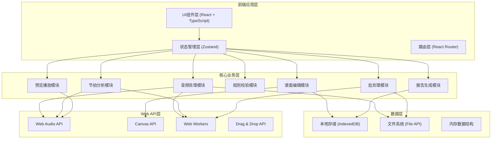
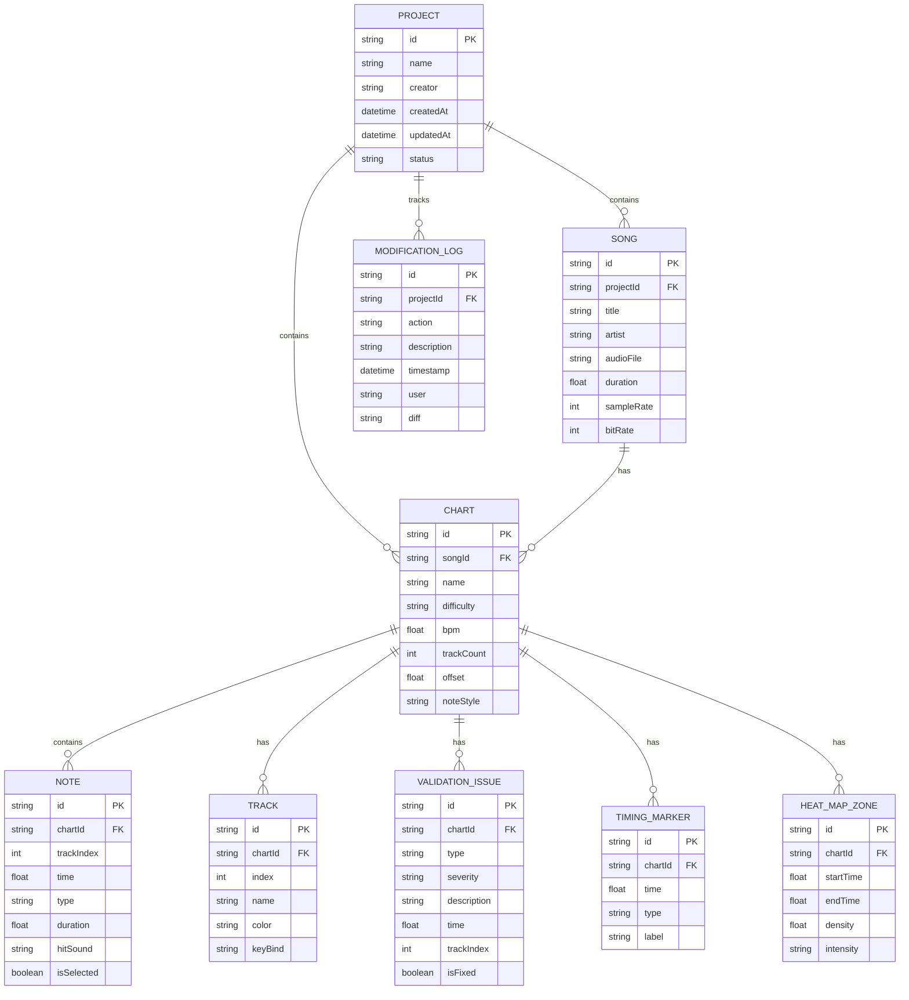

## 1. 架构设计



---

## 2. 技术描述

### 2.1 技术栈

| 类别 | 技术选型 | 版本 | 用途 |
|------|----------|------|------|
| 前端框架 | React | 18.2.0 | UI构建 |
| 语言 | TypeScript | 5.4.0 | 类型安全 |
| 构建工具 | Vite | 5.2.0 | 构建与开发 |
| 样式 | TailwindCSS | 3.4.0 | 原子化样式 |
| 状态管理 | Zustand | 4.5.0 | 全局状态 |
| 路由 | React Router | 6.22.0 | 页面路由 |
| 动画 | Framer Motion | 11.0.0 | 交互动画 |
| 图表 | Recharts | 2.12.0 | 数据可视化 |
| 图标 | Lucide React | 0.359.0 | 图标库 |
| 音频处理 | Web Audio API | - | 音频分析与播放 |
| 图形绘制 | Canvas API | - | 波形图与时间轴 |
| 多线程 | Web Workers | - | 后台BPM分析 |
| 数据库 | IndexedDB (Dexie.js) | 4.0.0 | 本地数据持久化 |

### 2.2 项目结构

```
src/
├── components/          # 通用组件
│   ├── layout/         # 布局组件
│   ├── ui/             # 基础UI组件
│   └── charts/         # 图表组件
├── pages/              # 页面组件
│   ├── Dashboard/      # 工作台主页
│   ├── AudioImport/    # 音频导入页
│   ├── BeatAnalysis/   # 节拍分析页
│   ├── TrackEditor/    # 轨道编辑页
│   ├── Validation/     # 规则校验页
│   ├── Preview/        # 试玩预览页
│   ├── BatchProcess/   # 批处理页
│   └── Reports/        # 报告页
├── store/              # 状态管理
│   ├── useProjectStore.ts
│   ├── useAudioStore.ts
│   ├── useBeatStore.ts
│   ├── useEditorStore.ts
│   └── useValidationStore.ts
├── hooks/              # 自定义Hooks
│   ├── useAudioAnalysis.ts
│   ├── useBPMDetection.ts
│   ├── useTimeline.ts
│   └── useWaveform.ts
├── utils/              # 工具函数
│   ├── audio/          # 音频处理
│   ├── beat/           # 节拍分析算法
│   ├── validation/     # 规则校验逻辑
│   ├── export/         # 导出功能
│   └── formatters.ts   # 格式化工具
├── types/              # TypeScript类型定义
│   ├── project.ts
│   ├── audio.ts
│   ├── beat.ts
│   ├── note.ts
│   └── validation.ts
├── workers/            # Web Workers
│   ├── bpmAnalysis.worker.ts
│   └── batchProcess.worker.ts
├── mock/               # Mock数据
│   ├── demoSongs.ts
│   └── demoCharts.ts
├── App.tsx
├── main.tsx
└── index.css
```

---

## 3. 路由定义

| 路由路径 | 页面名称 | 功能说明 |
|----------|----------|----------|
| `/` | 工作台主页 | 项目概览、快捷操作、统计数据 |
| `/audio-import` | 音频导入页 | 音频上传、波形预览、歌曲信息管理 |
| `/beat-analysis` | 节拍分析页 | BPM估算、小节线标记、热区生成 |
| `/track-editor` | 轨道编辑页 | 多轨道编辑、音符对齐、音效替换 |
| `/validation` | 规则校验页 | 质检检测、问题清单、难度估算 |
| `/preview` | 试玩预览页 | 谱面播放、模拟判定、节奏测试 |
| `/batch` | 批处理页 | 批量操作、多关卡处理 |
| `/reports` | 报告页 | 问题报告、版本对比、修改记录 |
| `/project/:id` | 项目详情 | 单个项目的综合视图 |

---

## 4. 核心数据模型

### 4.1 数据模型定义



### 4.2 关键类型定义

```typescript
// 项目类型
interface Project {
  id: string;
  name: string;
  creator: string;
  createdAt: Date;
  updatedAt: Date;
  status: 'draft' | 'reviewing' | 'completed';
  songs: Song[];
  charts: Chart[];
}

// 歌曲类型
interface Song {
  id: string;
  title: string;
  artist: string;
  audioFile: File | null;
  audioUrl?: string;
  duration: number;
  sampleRate: number;
  waveformData?: number[];
  bpm?: number;
  timeSignature?: [number, number];
}

// 谱面类型
interface Chart {
  id: string;
  songId: string;
  name: string;
  difficulty: 'easy' | 'normal' | 'hard' | 'expert' | 'master';
  difficultyLevel: number;
  bpm: number;
  trackCount: number;
  offset: number;
  notes: Note[];
  timingMarkers: TimingMarker[];
  tracks: Track[];
}

// 音符类型
type NoteType = 'tap' | 'hold' | 'slide' | 'swing';

interface Note {
  id: string;
  trackIndex: number;
  time: number;
  type: NoteType;
  duration?: number;
  hitSound?: string;
  isSelected?: boolean;
}

// 校验问题类型
type IssueSeverity = 'error' | 'warning' | 'info';
type IssueType = 'overlap' | 'too_dense' | 'misaligned' | 'missing_sound' | 'difficulty_spike';

interface ValidationIssue {
  id: string;
  type: IssueType;
  severity: IssueSeverity;
  description: string;
  time: number;
  trackIndex?: number;
  noteIds?: string[];
  isFixed: boolean;
  suggestion?: string;
}

// 校验结果
interface ValidationReport {
  chartId: string;
  totalIssues: number;
  issues: ValidationIssue[];
  estimatedDifficulty: number;
  noteDensity: number[];
  heatZones: HeatMapZone[];
  passedChecks: string[];
}
```

---

## 5. 核心模块技术设计

### 5.1 音频处理模块

```typescript
// BPM检测算法核心
interface BPMResult {
  bpm: number;
  confidence: number;
  beats: number[];
  intervals: number[];
}

function detectBPM(audioBuffer: AudioBuffer): Promise<BPMResult>;
function generateWaveform(audioBuffer: AudioBuffer, samples: number): number[];
function getAudioMetadata(file: File): Promise<SongInfo>;
```

### 5.2 节拍分析模块

```typescript
// 节拍网格生成
interface BeatGrid {
  bpm: number;
  offset: number;
  beats: BeatMarker[];
  measures: MeasureMarker[];
}

interface BeatMarker {
  time: number;
  beat: number;
  measure: number;
  isDownbeat: boolean;
}

function generateBeatGrid(bpm: number, offset: number, duration: number): BeatGrid;
function snapToGrid(time: number, grid: BeatGrid, snapDivision: number): number;
function calculateHeatMap(notes: Note[], windowSize: number): HeatMapZone[];
```

### 5.3 规则校验模块

```typescript
// 校验规则引擎
interface ValidationRule {
  id: string;
  name: string;
  description: string;
  severity: IssueSeverity;
  check: (chart: Chart) => ValidationIssue[];
}

const validationRules: ValidationRule[] = [
  { id: 'overlap', name: '重叠音符检测', ... },
  { id: 'density', name: '过密段落检测', ... },
  { id: 'alignment', name: '音符对齐检测', ... },
  { id: 'difficulty', name: '难度估算', ... },
];

function validateChart(chart: Chart): ValidationReport;
function fixIssue(chart: Chart, issue: ValidationIssue): Chart;
```

### 5.4 批量处理模块

```typescript
interface BatchOperation {
  type: 'offset' | 'rename' | 'replace_sound' | 'export' | 'validate';
  params: Record<string, any>;
}

interface BatchResult {
  successCount: number;
  failedCount: number;
  results: Array<{ chartId: string; success: boolean; message?: string }>;
}

async function executeBatchOperation(
  chartIds: string[],
  operation: BatchOperation,
  onProgress?: (current: number, total: number) => void
): Promise<BatchResult>;
```

---

## 6. 性能优化策略

1. **Web Workers**：将BPM分析、批量处理等耗时操作放入Worker线程，避免UI阻塞
2. **Canvas虚拟化**：时间轴音符只渲染可视区域，支持大量音符流畅滚动
3. **IndexedDB缓存**：波形数据、分析结果持久化存储，避免重复计算
4. **请求分块**：音频文件分块解码，大文件处理更流畅
5. **状态分片**：Zustand状态按模块分片，减少不必要的重渲染
6. **防抖节流**：编辑器实时操作使用防抖，避免频繁校验

---

## 7. 导出格式支持

| 格式 | 扩展名 | 说明 |
|------|--------|------|
| JSON | .json | 通用谱面格式，含完整元数据 |
| OSU | .osu | Osu! 谱面格式 |
| BMS | .bms | BMS 格式 |
| 自定义 | .chart | 本工具专用格式 |
| 关卡包 | .zip | 含音频、谱面、音效的完整包 |
| 报告 | .pdf/.xlsx | 质检报告、问题清单 |
